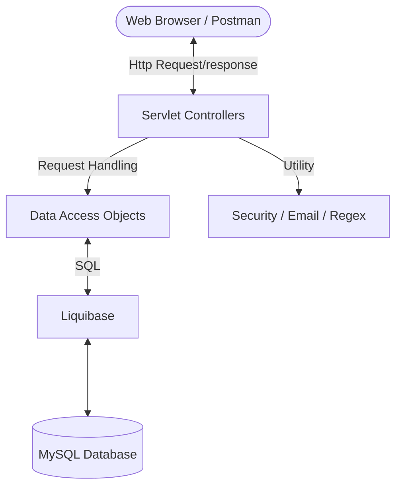

# Banking Application

A Secure banking application built using **Jakarta Servlets** and **Java 17**. User can create account , **Login** to your account , **Credit** and **Debit** amount to other users , Check you **Balance** and view **Statement** .
Admin can Monitor user details.

---

## Tech Stack

* **Java:** Java 17 
* **Server:** Apache Tomcat 10
* **API Framework:** Jakarta Servlet API
* **Database:** MySQL with HikariCP Connection Pooling and Liquidbase for versoning
* **Build Tool:** Maven
* **Security:** Session Management , JWT Authentication , Bcrypt,AES
* **Logging:** SLF4J

---

##  Features

* **Account Management:** CRUD operations for user profiles and bank accounts.
* **Transaction ** Processing for **Debit** and **Credit** operations.
* **Security First:** Password Hashin using Bcrypt , Data Encryption using AES.
* **Automated Alerts:** Integrated `EmailSender` for registration welcome message. 
* **Database Versioning:** Version-controlled database changes using Liquibase.

---

## Project Architecture

##  API Endpoints Summary
**Sample API Endpoint :** http://localhost:8080/ServletDemo/register.
| S.No | Endpoint | Method | Inputs Needed | Description |
| :--- | :--- | :---: | :--- | :--- |
| 1 | `/register` | `POST` | `UserName`, `email`, `password` | Registers a new user and creates unique id for them. |
| 2 | `/login` | `POST` | `username`, `password` | Authenticates a user and creates a secure session. |
| 3 | `/user/debit` | `POST` | `amount` | Debits the money after checking withdrawer balance. |
| 4 | `/user/credit` | `POST` | `Receiver_ID`, `amount` |Credits the money after checking sender balance. |
| 5 | `/user/balance` | `GET` | `null` | Retrieves balance Amount. |
| 6 | `/user/statement` | `GET` | `accountID` | Gives the List of Transactions Made. |
| 6 | `/admin/users` | `GET` | `null` | Gives the List of users. |

---

**Credentials in application.properties**  
URL = Your database url.  
USER = Your database username.  
PASS = You database password.  
SECRET_KEY = 16 digit secret key for Encryption.  

---

##  Author  
SRIVIGNESH M,  
JAVA BACKEND DEVELOPER  
srivigneshm1609@gmail.com
